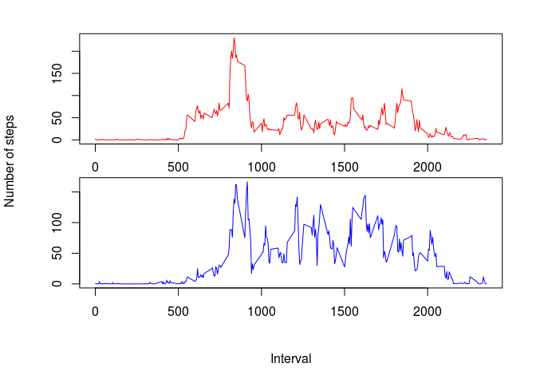

# Reproducible Research: Peer Assessment 1


## Loading and preprocessing the data

```r
library('dplyr')
```

```
## 
## Attaching package: 'dplyr'
## 
## The following object is masked from 'package:stats':
## 
##     filter
## 
## The following objects are masked from 'package:base':
## 
##     intersect, setdiff, setequal, union
```

```r
unzip('activity.zip')
activityNA <- read.csv('activity.csv')
activity <- na.omit(activityNA)
```

- The activityNA data contains all the rows and the activity data contains
only the rows without NA values.

## What is mean total number of steps taken per day?
- Group the data by date and calculate the sum of steps for each day.
Make the histogram for the total number of steps per day.

```r
by_date <- group_by(activity,date)
dailysteps <- summarize(by_date, steps = sum(steps))
par(mfcol = c(1,1))
hist(dailysteps$steps, main = 'Histogram of daily steps',
     xlab = 'Number of steps', ylab = 'Number of days')
```

 

- Calculate the mean and the median.

```r
mean(dailysteps$steps)
```

```
## [1] 10766.19
```

```r
median(dailysteps$steps)
```

```
## [1] 10765
```

## What is the average daily activity pattern?
- Group the data by interval and calculate the mean of steps for each interval.

```r
by_interval <- group_by(activity,interval)
meanint <- summarize(by_interval, steps = mean(steps))
```

- Add leading zeros to the interval values so that each value consists of 4
characters.

```r
for(j in 1:288) {
    if(nchar(meanint$interval[j]) == 1) {
        meanint$interval[j] <- paste('000',meanint$interval[j], sep = '')
    }
    if(nchar(meanint$interval[j]) == 2) {
        meanint$interval[j] <- paste('00',meanint$interval[j], sep = '')
    }
    if(nchar(meanint$interval[j]) == 3) {
        meanint$interval[j] <- paste('0',meanint$interval[j], sep = '')
    }
}
```

- Change the interval values to POSIXlt class values and plot the timeline.

```r
tmp <- strptime(meanint$interval, '%H%M')
plot(tmp, meanint$steps, type = 'l',
     main = 'Average number of steps per 5 minute interval', 
     xlab = 'Daytime', ylab = 'Mean number of steps')
```

 

- Identify the interval with the maximum average number of steps.

```r
tmp2 <- which(meanint$steps == max(meanint$steps))
meanint[tmp2,1]
```

```
## Source: local data frame [1 x 1]
## 
##   interval
## 1     0835
```

## Imputing missing values

- The total number of missing values is 2304 which can be seen in the table.

```r
table(complete.cases(activityNA))
```

```
## 
## FALSE  TRUE 
##  2304 15264
```

- Idetify the rows where the missing values are located and replace the NA
values with the mean number of steps for this interval.

```r
b <- which(complete.cases(activityNA) == F)

for(i in 1:2304) {
    if(b[i] %% 288 == 0) {
        activityNA$steps[b[i]] <- meanint$steps[(b[i] %% 288) + 288]
    }
    else {
        activityNA$steps[b[i]] <- meanint$steps[b[i] %% 288]
    } 
}
```

- Group the new data by date, plot the new histogram and calculate mean and
median.

```r
by_dateNA <- group_by(activityNA,date)
dailystepsNA <- summarize(by_dateNA, steps = sum(steps))
hist(dailystepsNA$steps, main = 'Histogram of daily steps',
     xlab = 'Number of steps', ylab = 'Number of days')
```

 

```r
mean(dailystepsNA$steps)
```

```
## [1] 10766.19
```

```r
median(dailystepsNA$steps)
```

```
## [1] 10766.19
```
- The new mean value is still the same whereas the median value changed
slightly. So the impact of imputing missing data on the estimates is not very
strong.

## Are there differences in activity patterns between weekdays and weekends?
- Add leading zeros to the interval values so that each value consists of 4
characters.

```r
for(k in 1:17568) {
    if(nchar(activityNA$interval[k]) == 1) {
        activityNA$interval[k] <- paste('000', activityNA$interval[k], sep = '')
    }
    if(nchar(activityNA$interval[k]) == 2) {
        activityNA$interval[k] <- paste('00', activityNA$interval[k], sep = '')
    }
    if(nchar(activityNA$interval[k]) == 3) {
        activityNA$interval[k] <- paste('0', activityNA$interval[k], sep = '')
    }
}
```

- Building a new time variable using date and interval.

```r
activityNA <- mutate(activityNA, DateTime = paste(activityNA$date,
    activityNA$interval, sep = ' '))
    
activityNA$date <- NULL

activityNA$DateTime <- strptime(activityNA$DateTime, '%Y-%m-%d %H%M')
```

- Use the weekdays function to determine the weekday. The cut function makes
a factor variable with two levels: weekday and weekend.

```r
wd <- weekdays(activityNA$DateTime)
test <- as.numeric(format(activityNA$DateTime,'%u'))
activityNA$wd <- cut(test, breaks = c(0,5,7), labels = c('weekday','weekend'))
activityNA$DateTime <- as.POSIXct(activityNA$DateTime)
```

- Group the data, calculate the mean number of steps for each interval for the
weekday days and the weekend days.

```r
by_wd <- group_by(activityNA, wd, interval)
wdmean <- summarize(by_wd, stepmean = mean(steps))
weekday <- wdmean[1:288,]
weekend <- wdmean[289:576,]

par(mfcol = c(2,1), oma = c(5,4,1,1) + 0.1,
          mar = c(1,1,1,1) + 0.1)
plot(weekday$interval,weekday$stepmean, type = 'l', col = 'red')
plot(weekend$interval,weekend$stepmean, type = 'l', col = 'blue')
title(xlab = 'Interval', ylab = 'Number of steps', outer = T)
```

 

- The average number of steps at the weekend is greater than the average number
of steps at the weekdays for interval values greater than 1000. For interval
values between 500 and 800 the weekday values are greater than the weekend
values.

